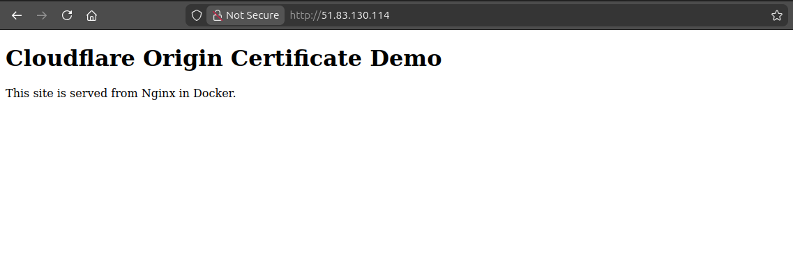
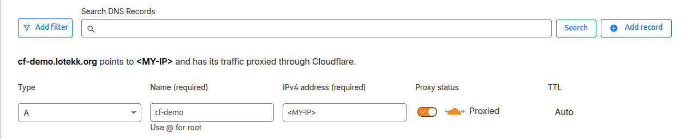
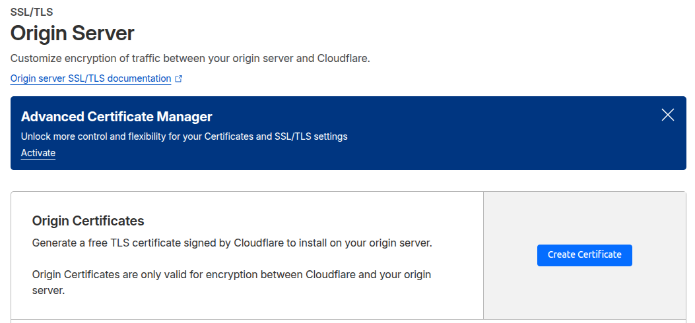
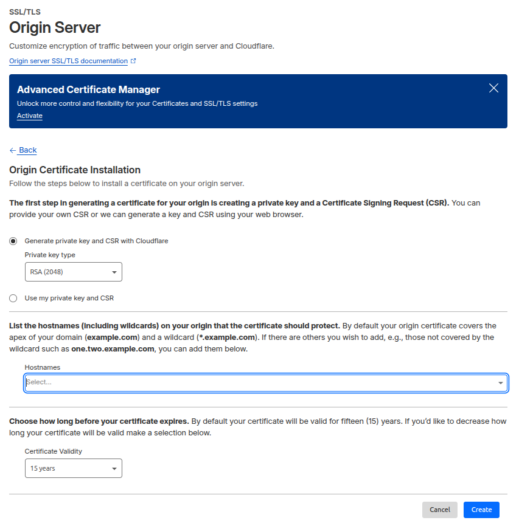

# cf-demo

A hands-on project deploying Nginx in Docker on a VPS and using Cloudflare for DNS, CDN, WAF, and secure HTTPS traffic to the server.

**1. Installing docker**

First, after securing my new VPS server with SSH hardening i installed Docker following <a href='https://docs.docker.com/engine/install/ubuntu/'>this<a/> guide.

**2. Creating folder structure**

```
cloudflare-nginx-demo/
├── docker-compose.yml        
├── nginx/
│   └── default.conf          
├── html/
│   ├── index.html            
│   └── security-demo.html    
├── certs/
│   ├── origin.pem            
│   └── origin.key            
└── README.md                 
```
**3. Making a simple temporary webpage**

```
<!DOCTYPE html>
<html>
<head>
  <title>My Demo</title>
</head>
<body>
  <h1>Cloudflare Origin Certificate Demo</h1>
  <p>This site is served from Nginx in Docker.</p>
</body>
</html>
```

**4. Setting up an Nginx docker container**

First I will add a simple configuration for nginx, we can find some informations about basic configuration <a href='https://nginx.org/en/docs/beginners_guide.html'>here<a/>.
```
server {
    listen 80;
    server_name _;

    root /usr/share/nginx/html;
    index index.html;

    location / {
        try_files $uri $uri/ =404;
    }
}
```
Im setting up my server using HTTP only for now, later we will change that. 

Now its time put configuration of our container in docker-compose.yaml.
```
services:
  nginx:
    image: nginx:alpine
    container_name: nginx-cloudflare
    ports:
      - "80:80"
    volumes:
      - ./nginx/default.conf:/etc/nginx/conf.d/default.conf:ro
      - ./html:/usr/share/nginx/html:ro
    restart: unless-stopped
```
We start it using 
```docker compose up -d```
and check running containers
```docker ps```.

Now I can see my webpage by typing ```http://<MY-IP>``` in my browser.



**5. Adding domain to Cloudflare DNS**

After creating a Cloudflare account and buing a domain, under DNS -> Records we can add a DNS A record for our IP adress.



After a few minutes the simple webpage should be accessible here ```http://your-domain.com```.

**6. Generating Cloudflare Origin Certificate**

Now its time to generate SSL certificate. Under SSL/TLS -> Origin Server click Create Certificate.



Choose RSA (2048) and specify hostnames that you want to include. Choose time of certificate validity and click Create.



Now copy:

Origin Certificate -> origin.pem

Private Key -> origin.key

Also we should change permissions for the files containing certificates.

```
chmod 644 certs/origin.pem
chmod 600 certs/origin.key
```

**7. Changing Nginx configuration to enable HTTPS**

Now in the config we redirect HTTP traffic to HTTPS:

```
server {
    listen 80;
    return 301 https://$host$request_uri;
}

server {
    listen 443 ssl;
    server_name <your-domain.com>;

    ssl_certificate /etc/nginx/certs/origin.pem;
    ssl_certificate_key /etc/nginx/certs/origin.key;

    root /usr/share/nginx/html;
    index index.html;
}
```

And in the docker-compose.yaml we add our certificates folder and expose HTTPS port:

```
ports:
  - "80:80"
  - "443:443"

volumes:
  - ./nginx/default.conf:/etc/nginx/conf.d/default.conf:ro
  - ./html:/usr/share/nginx/html:ro
  - ./certs:/etc/nginx/certs:ro
```
Now we can use ```docker compose up d``` to run our container with a new configuration.

And there it is


**8. Changing encryption mode to Full**

In Cloudflare under Domains -> Configure SSL/TLS -> Configure set Custom SSL/TLS to Full (Strict).

Full (Strict) ensures that Cloudflare only connects to the origin server over HTTPS using a valid and trusted certificate, providing end-to-end encryption.

9. 
